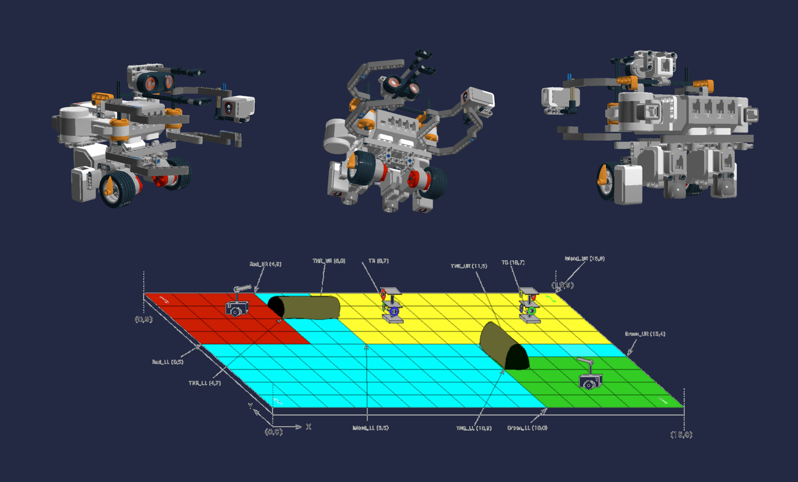

# Design Principles & Methods - Fall 2018 - McGill University

### ROLES

**Project Manager** – Mia Yuxin Zhou  
**Document Manager** – Rayan Osseiran  
**Software Engineer** - Mai Zeng  
**Hardware Lead** – Kexin Xu  
**Testing Lead** – Tooba Rahimnia

### OBJECTIVE

Design and construct a robot that can autonomously navigate a closed course in search of a set of colored rings.  
Built through the use of a Lego EV3 as well as the Lejos API which enables the EV3 brick to be programmed in Java.

### REQUIREMENTS

1) Receive set of parameters from Wi-Fi class  
2) Localize under 30 seconds 
3) Navigate to the tunnel  
4) Traverse tunnel  
5) Navigate to Tree  
6) Grab one or more rings  
7) Detect the color of each rings  
8) Navigate back to the start  
9) Limit of 5 minutes

### HIGHLIGHTS

#### Crab mechanism: 
 
• Successful and consistent ring collection   
• Hook allows colour to be detected after collecting

#### Navigation:
 
• Excellent precision   
• Highly accurate odometer due to two light sensors

### TESTING PHASE

#### PHASE ONE - HARDWARE

• Testing of individual components such as light sensors, ultrasonic sensors and motors    
• Optimal wheel radius and track values     
• Optimal light sensor positioning 

#### PHASE TWO - SOFTWARE

• Localization  
• General navigation   
• Tunnel Traversal    
• Ring grabbing     
• Wi-Fi test

#### PHASE THREE - INTEGRATION

• Beta demo testing    
• Testing for optimal robot speed    
• Probability of failure vs success     
• Integrated localization, navigation and ring collection testing
 
